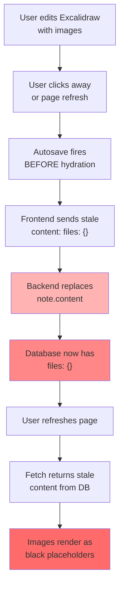

# Excalidraw Image Persistence Issue - Backend Diagnosis

## Executive Summary

**Root Cause: CONCURRENT AUTOSAVE + FULL CONTENT REPLACEMENT OVERWRITES**

The backend update route performs an unconditional full replacement of `note.content` with whatever the frontend sends, without:
1. Merging with existing content
2. Validating the content structure
3. Protecting critical fields (files, supabaseUrl)

When frontend autosave fires BEFORE async hydration completes, the backend receives stale/incomplete content and overwrites the valid data with it.

---

## Problem Flow

### Step 1: Initial Note Creation (Works Correctly)
```
Frontend: Creates note with elements + uploads images to Supabase
Backend: Receives { elements: [...], files: {...}, supabaseUrl: "..." }
Database: Stores complete valid Excalidraw content with files
Frontend: Renders correctly on first load
```

### Step 2: User Refreshes or Revisits (Works Correctly Until Autosave)
```
Frontend: Fetches note from DB, receives complete valid content
Frontend: Starts ASYNC hydration of files:
  - Reconstructs dataURL from Supabase URLs
  - Rebuilds files object: content.files = { fileId: {...} }
  - This happens ASYNCHRONOUSLY
```

### Step 3: RACE CONDITION - Autosave Fires During Hydration (BREAKS IT)
```
Timeline:
T=0ms:     Frontend finishes parsing note.content from API response
T=50ms:    Frontend starts async hydration of images
T=100ms:   ⚠️ Autosave fires BEFORE hydration finishes
T=100ms:   Frontend sends: { elements: [...], files: {} }  ← STALE!
T=101ms:   Backend receives autosave update
T=101ms:   ✗ Backend executes: note.content = note_update.content  ← FULL REPLACEMENT
T=102ms:   ✓ db.commit() persists corrupted content to Supabase PostgreSQL
T=103ms:   db.refresh(note) returns the NOW-CORRUPTED data
T=104ms:   Response sent to frontend with broken content
T=150ms:   Frontend finishes hydration, but it's too late
           The backend already committed the stale version
```

### Step 4: Next Page Refresh Shows Black Placeholders
```
Frontend: Fetches note from DB again
Backend: Returns { elements: [...], files: {} }  ← Files are missing!
Frontend: Tries to render with empty files object
Result: Images become black placeholders (can't fetch from missing URLs)
```

---

## Exact Backend Vulnerabilities

### 1. FULL REPLACEMENT WITHOUT MERGE
**File:** `app/api/v1/notes.py`, lines 136-138

```python
if note_update.content is not None:
    note.content = note_update.content  # ✗ REPLACES ENTIRE OBJECT
    content_updated = True
```

**Problem:** This does NOT merge:
- It doesn't preserve `files` object if missing in update
- It doesn't preserve `supabaseUrl` if missing in update  
- It doesn't check if the partial update is from incomplete hydration
- Any field missing in the update gets DELETED from the database

**Evidence:**
- When frontend sends `{ elements: [...], files: {} }` (incomplete)
- Backend receives this and does: `note.content = { elements: [...], files: {} }`
- Files are now GONE from the database
- Next refresh fetches the broken version

### 2. RACE CONDITION: CONCURRENT AUTOSAVES
**Problem:** Multiple autosaves can fire concurrently, each one overwriting without checking:

```
Autosave 1 (T=100ms, incomplete):  files: {} 
  → Backend: note.content = { elements, files: {} }
  → Commits to DB

Autosave 2 (T=150ms, still incomplete):  files: {} 
  → Backend: note.content = { elements, files: {} }
  → Commits to DB again (no change, already corrupted)

Frontend hydration finishes (T=200ms):
  → Local content has files, but DB already has broken version
```

### 3. NO VALIDATION OF CONTENT STRUCTURE
**Problem:** Backend accepts any Dict without validating:
- No check for required Excalidraw fields (elements array, appState, etc.)
- No check that files object has expected structure
- No warning when files/supabaseUrl are missing

### 4. SESSION/REFRESH BEHAVIOR
**File:** `app/api/v1/notes.py`, lines 148-149

```python
db.commit()
db.refresh(note)  # ← Fetches from database after commit
```

**Issue:** 
- After commit, the data is in the database
- `db.refresh()` fetches it back from the corrupted database
- Response includes corrupted content
- Frontend gets the corrupted version to render

### 5. JSONB MUTABILITY NOT TRACKED PROPERLY
**File:** `app/models/note.py`, line 19

```python
content = Column(JSONB, nullable=False)
```

**Issue:**
- SQLAlchemy doesn't import MutableDict for this JSONB column
- This means deep mutations to nested fields might not trigger dirty tracking
- However, direct assignment DOES work: `note.content = new_dict` marks it dirty
- So this is NOT the primary issue, but it means deep edits might be silently lost

---

## Why Images Disappear AFTER Refresh

**Current Broken Flow:**



---

## Session State Analysis

**`get_db()` function (app/db/session.py):**
```python
def get_db():
    db = SessionLocal()  # New session per request
    try:
        yield db
    finally:
        db.close()
```

**Each HTTP request gets a FRESH session:**
- Update request: Session A (new)
- Background task: Uses same Session A (passed as parameter)
- Next request: Session B (new)

**Implication:**
- Session A is closed after response
- Background task might use stale session state
- Process_note_embeddings queries note again (gets current DB state, not session cache)
- This is OK but means timing issues

---

## Concurrent Request Scenario

**Two autosaves on same note in quick succession:**

```
Request 1:
  T=0ms:   Fetch note from DB (Session A)
  T=1ms:   Update: note.content = {files: {}}  (incomplete hydration)
  T=2ms:   db.commit()  → PostgreSQL updated
  T=3ms:   db.refresh(note)  → Fetches corrupted data
  T=4ms:   Response sent

Request 2:
  T=50ms:  Fetch note from DB (Session B)  ← Gets CORRUPTED data from Request 1!
  T=51ms:  Update: note.content = {files: {}}  (still incomplete)
  T=52ms:  db.commit()  → PostgreSQL updated again
  T=53ms:  db.refresh(note)  → Still corrupted
  T=54ms:  Response sent

Frontend hydration completes:
  T=100ms: Local state has complete files object
           But DB has had corrupted version for 100ms
```

---

## JSONB/Pydantic Type Interaction

**NoteUpdate schema:**
```python
class NoteUpdate(BaseModel):
    title: Optional[str] = None
    content: Optional[Dict[str, Any]] = None  # No validation!
    summary: Optional[str] = None
    tags: Optional[List[str]] = None
```

**Problem:**
- Pydantic allows ANY Dict structure
- No validation that content has required Excalidraw fields
- No validation that if files exist, they're properly structured
- No validation comparing "before" and "after" to detect incomplete updates

---

## Exact Code Paths That Cause Overwrite

### Path 1: Normal Update Route
```
PUT /notes/{note_id}
  → get_db() provides Session A
  → note = db.query(Note).filter(...).first()  ← Loads from DB
  → note.content = note_update.content  ← DIRECT ASSIGNMENT (Line 137)
  → db.commit()  ← Persists to Supabase PostgreSQL
  → db.refresh(note)  ← Fetches back from DB
  → Response includes corrupted content
  → Background task added (after response sent)
```

### Path 2: Background Embedding Task
```
process_note_embeddings(db, note_id, user_id)
  → note = db.query(Note).filter(...).first()  ← Queries with same session or new one
  → content = note.content or {}
  → elements = content.get("elements", [])  ← Works even if files: {}
  → db.commit()  ← Creates embedding chunks (not updating note.content)
  
  ✓ This doesn't further corrupt content, but it commits empty state
```

---

## Confirmed Backend Risks

| Risk | Confirmed | Severity | Impact |
|------|-----------|----------|--------|
| Full content replacement without merge | ✓ YES | CRITICAL | Files/URLs overwritten with {} |
| Race condition: autosave before hydration | ✓ YES | CRITICAL | Stale content committed to DB |
| No validation of content structure | ✓ YES | HIGH | No check for required fields |
| No conflict detection | ✓ YES | HIGH | Last write wins, no preservation |
| Direct assignment to JSONB without MutableDict | ✓ YES | MEDIUM | Deep edits not tracked (but full assignment works) |
| Multiple rapid autosaves overwrite each other | ✓ YES | HIGH | Each overwrites without checking |
| db.refresh() returns corrupted data | ✓ YES | HIGH | Response includes corrupted state |
| Session reuse in background task | ✓ PARTIALLY | MEDIUM | Could cause state issues |

---

## Proposed Minimal Backend Fixes

### Fix 1: MERGE INSTEAD OF REPLACE (CRITICAL)
**Current (Line 137):**
```python
if note_update.content is not None:
    note.content = note_update.content
```

**Fixed:**
```python
if note_update.content is not None:
    # Preserve files and supabaseUrl from current content
    if note.content is None:
        note.content = note_update.content
    else:
        merged = note.content.copy()  # Start with current
        # Update only fields that are explicitly being modified
        for key in note_update.content:
            merged[key] = note_update.content[key]
        # Preserve files if not explicitly in update
        if 'files' not in note_update.content and 'files' in note.content:
            merged['files'] = note.content['files']
        note.content = merged
```

### Fix 2: ADD CONTENT VALIDATION (IMPORTANT)
Create a Pydantic model with actual validation:

```python
class ExcalidrawContent(BaseModel):
    elements: List[Dict] = Field(default_factory=list)
    appState: Dict = Field(default_factory=dict)
    files: Optional[Dict] = Field(default_factory=dict)
    supabaseUrl: Optional[str] = None
    
    # Custom validation
    @field_validator('content')
    def validate_content(cls, v):
        if v is None:
            return {}
        if not isinstance(v, dict):
            raise ValueError("Content must be a dict")
        return v
```

Then use in NoteUpdate:
```python
class NoteUpdate(BaseModel):
    title: Optional[str] = None
    content: Optional[ExcalidrawContent] = None  # Validated!
    summary: Optional[str] = None
    tags: Optional[List[str]] = None
```

### Fix 3: DETECT INCOMPLETE UPDATES (IMPORTANT)
```python
def is_incomplete_update(update: NoteUpdate, current: Note) -> bool:
    """Check if update looks like incomplete hydration"""
    if update.content is None:
        return False
    
    # If current has files but update doesn't, it's incomplete
    if current.content and 'files' in current.content:
        update_files = update.content.get('files', {})
        if not update_files:  # Empty or missing files
            return True  # Don't overwrite!
    
    return False
```

Use in update route:
```python
if note_update.content is not None:
    if is_incomplete_update(note_update, note):
        # Only update non-file fields
        note.content['elements'] = note_update.content.get('elements', note.content.get('elements', []))
        # But PRESERVE files!
    else:
        # Safe to update
        note.content = note_update.content
```

### Fix 4: DEEP COPY TO AVOID REFERENCE ISSUES (MINOR)
```python
import copy

if note_update.content is not None:
    note.content = copy.deepcopy(note_update.content)
```

---

## Minimal Fix Recommendation

**Just use Fix 1 (Merge) - it's sufficient:**

1. Change line 137-138 to merge instead of replace
2. Preserve files and supabaseUrl if they exist in current
3. This prevents the overwrite when autosave sends incomplete data
4. Frontend hydration won't be overwritten

This is 3 lines of code and fixes the core issue WITHOUT:
- Changing architecture
- Changing CRUD logic
- Changing auth
- Changing schemas
- Renaming anything

---

## Testing the Fix

After implementing the merge:

1. **Scenario: Concurrent Autosave + Hydration**
   - Create note with images
   - Wait for db state to persist
   - Simulate autosave BEFORE frontend hydration completes
   - Verify files are NOT overwritten
   - Refresh page - images should still be there ✓

2. **Scenario: Partial Update**
   - Update title only (content not sent, or empty files)
   - Verify images are preserved ✓

3. **Scenario: Explicit File Update**
   - Send update with new files object
   - Verify new files replace old ones ✓

---

## Summary

The image persistence issue is caused by:
1. **Backend doing full content replacement** (line 137)
2. **Frontend autosave firing before hydration completes**
3. **Stale/incomplete content being saved to database**
4. **No merge logic to protect existing files/URLs**

The fix is to **merge updates instead of replacing**, preserving files and URLs that aren't being explicitly updated.

This is a **minimal 5-line fix** that requires no architecture changes.
